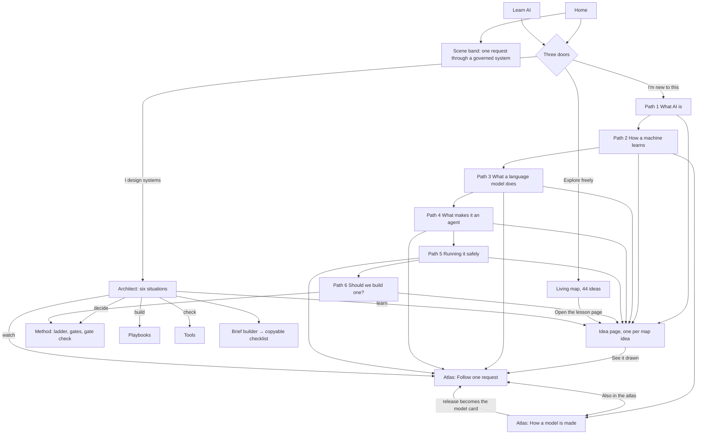
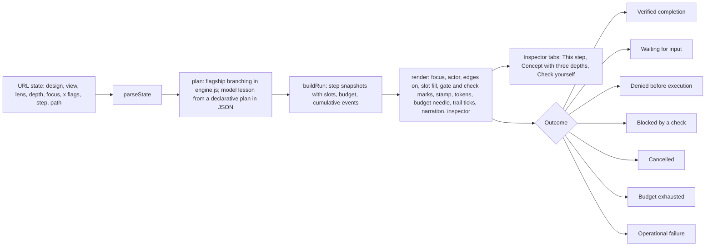

# khalidshams.com · visual system and flow

Inventory taken from the repository on 2026-10-03, not from memory. Every item names the file that defines it. This is the reference for assessing presentation, the drawing language and the site flow.

## 1. Identity

| Item | Where | Notes |
|---|---|---|
| Logo mark | `static/logo.png`, `static/icon-32/180/192/512.png`, `static/og.png` | "KS" monogram. Navy `#012480`, gold `#D4AF56`. Used in the masthead at 28px and as favicon, app icon and share image. |
| Wordmark | `templates/masthead.html` `.sh-brand` | "Khalid Shams" in IBM Plex Mono, uppercase, tracked, with "Principal Solutions Architect" beside it on wide screens. |
| Type | `templates/base.html` `:root` | Display: Instrument Serif (headlines, pull quotes, section h2, big numbers). Text: IBM Plex Sans, weight 300 body, 500 and 600 for emphasis. Labels and code: IBM Plex Mono, uppercase, letter-spaced (`.eyebrow`, `.sec-label`, `.t-m`). |
| Voice in type | everywhere | Headlines are a statement with one italic cobalt phrase (`h1 em`). Mono uppercase labels name sections; serif carries the idea; sans carries the explanation. No em dashes or en dashes anywhere public (CLAUDE.md rule). |

## 2. Tokens (`templates/base.html` `:root`, dark under `prefers-color-scheme` and `[data-theme="dark"]`)

| Token | Light | Dark | Meaning |
|---|---|---|---|
| `--paper` | #F7F7F5 | #0D0F11 | page ground |
| `--card` | #FFFFFF | #14171A | raised surface |
| `--sunk` | #EFEFEC | #101315 | recessed surface (stations, trays) |
| `--ink` | #0E1012 | #F1F2F1 | headings, people, strong lines |
| `--body` | #3E4449 | #B9C0C5 | running text |
| `--mute` / `--faint` | #6B737A / #939BA2 | #8E969D / #6B737A | secondary text, labels |
| `--rule` / `--rule2` | #E0E0DB / #C6C6BF | #232830 / #343B45 | hairlines, thin construction lines |
| `--blue` / `--blue-soft` | #1F45C8 / #E7EBFB | #8FA6FF / #161C33 | cobalt: focus, control, the selected thing |
| `--gold` / `--gold-ink` / `--gold-soft` | #B8912F / #86661A / #F6EED9 | #D4AF56 / #DDBB66 / #2A2312 | gold: cost, budget, approval pending, held-out data |
| `--warn` / `--warn-soft` (atlas) | #B4442E / #F8E6E1 | #F08A72 / #2A1712 | coral: denial, error, blocked, planted content |

Layout tokens: `--wrap` 1680px fluid, `--pad` clamp(16px, 4vw, 72px), `--measure` 66ch for running text, `--label-col` for the label column in `.sec-head`, `.case`, `.pb-body`. From 1100px heroes and section heads are two-column grids.

## 3. The drawing language (the grammar every picture follows)

Defined in `atlas_scene.py` (helpers and the flagship scene), reused by `atlas_scene_model.py` and `vignettes.py`.

1. **Solid figures are people.** `person()`: filled silhouette, head and shoulders. Requester, owner, approver, rater, release owner.
2. **Outline figures are software.** `operator()`: outline head and shoulders with a small cobalt badge. Represents behaviour drawn as an operator; the legend says it does not understand or intend anything.
3. **A dashed rounded rectangle is a boundary.** The application runtime wall, a specialist's own context. Crossing it is the event that matters.
4. **A gate is where a decision is enforced.** Narrow post on the boundary with a cobalt badge; a mark beside it: ✓ allowed, ✕ denied, ⏸ waiting for approval. Marks are text, never colour alone.
5. **A check plate is a rule in code**, drawn before the gate (shield glyph, "CHECK"), with its own ✓ or ✕. Distinguishes argument checks from permission checks.
6. **The desk is the context.** A trapezoid tray (`.top`) with labelled slots; a slot fills (cobalt document icon, solid border) when that thing is on the desk for the next model call.
7. **Cards are things you can read:** goal card, proposed operation, work order, passage, policy document. Dashed card borders mean empty or not yet granted.
8. **Stations are places work happens:** recessed `.sunk` rectangle with a mono label (specialist station, training loop, tool dock, model engine).
9. **Lines are typed.** Data: solid ink with a dot head. Control: cobalt dashed with an arrowhead (a proposal, a call, a work order, adjusting parameters). Approval route: cobalt dotted. Ownership: grey dotted with an open arrowhead. The legend on each lesson repeats this.
10. **Colour semantics:** cobalt is focus and control, gold is cost and pending, coral is denial, error or planted content. Every colour meaning also has a non-colour cue (mark, dash pattern, label, strike-through).
11. **Learn-first links never appear as arrows.** They are ◇ links in the inspector.
12. **Explicit fallback fills on every shape** (`STY` and `TXT` dictionaries), so a drawing renders standalone, and the site tokens override them through `.atlas-scene` (atlas) or `.vig` (vignettes) CSS. Regression tests check every `rect/path/circle/ellipse/polygon` carries `fill=`.
13. **Picture and Architecture are two layers of the same object** (`.pic` and `.arch` at the same footprint). Architecture replaces the picture with a labelled box and port dots: "LLM API", "Tokenizer", "Eval suite".

## 4. The scene vocabulary (reusable parts)

| Part | Function | Drawn as |
|---|---|---|
| Person | `person(x, y, s, label, sub)` | solid silhouette, name and role under it |
| Operator | `operator(x, y, s)` | outline silhouette, cobalt badge |
| Card / sunk / top | `rect(..., "card"/"sunk"/"top")` | raised, recessed, desk surface |
| Gate | flagship: inline; vignettes: `gate(x, y, mark)` | post + badge + mark |
| Check plate | flagship `hook` object; vignettes in `act()` | shield + CHECK + mark |
| Context tray | flagship `context` with 8 `.slot` groups | trapezoid with labelled slots |
| Document | `doc()` in vignettes; `.slot-doc` in the tray | small lined rectangle |
| Shelves | flagship `retrieval`, model `corpus`, vignette `knowledge` | rows of spines, some cobalt |
| Binder / cabinet | flagship `skills`, `memory` | binder with tabs; drawer cabinet |
| Model engine | flagship `model`, vignettes | recessed box, gauge dial, two slots, a row of token tiles |
| Tool dock and MCP ports | flagship `tool`, `mcp` | dock with lookup, $ and envelope; cobalt port squares |
| Budget gauge | flagship `budget`, vignette `Operate` | half-dial with gold needle, "n/10" |
| Hand-off tray | flagship `recovery`, vignette `back-office` | tray with slips |
| Event trail | flagship `observability`, model `trail` | long card, ticks (cobalt ok, coral deny) |
| Approver card and stamp | flagship `approver` | proposed operation, dashed stamp: awaiting, reviewing, approved |
| Specialist station | flagship `specialist` | sunk station, operator, work order and result cards, struck-out permission |
| Rings | model `ai_rings`, vignette `Foundations` | nested ellipses AI > ML > deep > LLM |
| Tokenizer and token tiles | model `tokenizer`, vignette `Language` | sentence, cut tiles |
| Embedding map | model `embedmap` | dots on two axes, a dashed cluster |
| Transformer stack | model `network` | repeated blocks: attention fan + small mesh, ×N bracket |
| Parameter dials | model `dials`, vignette `Learning` | round dials with cobalt needles |
| Enlarged neuron | model `neuron_zoom` | three inputs, weights, Σ, f |
| Training loop | model `loop`, vignette `Learning` | predict → compare → adjust, "again" return |
| Loss chart | model `losschart` | training solid, held-out dashed (turns coral when overfitting) |
| Checkpoint cartridge | model `checkpoint` | tagged cartridge "base-v0" |
| Preference pairs | model `align_station` | A / B cards, a rater, a gold principles card |
| Evaluation bench | model `eval_bench` | three criteria rows with ✓ / ✕ marks |
| Release registry | model `release` | pinned version chip, release owner |
| Autonomy ladder | vignette `decide` | five rising bars, rung 2 cobalt |
| Representation bars | model `corpus`, vignette `Society` | grouped bars, skew shown in coral or gold |

## 5. Scenes

### 5a. Flagship: "Follow one request through a governed AI system" (`atlas_scene.py`, 1280×800, route `/learn/atlas/`)
24 objects (`data-o` → concept, SHAMS lenses): owner→owner (S, Su); requester→requester (S); skills→skills (M, Su); memory→memory (A, H); retrieval→retrieval (A); goal→verification (S, M); coordinator→coordinator (S, M); model→model (M, Su); agent→agent (S, H, M, Su); context→context (A); tool→tool (H); mcp→mcp (H); hook→guardrails (H, M); gate_orders, gate_refunds, gate_msg→authorization (H); svc_orders, svc_refunds, svc_messaging→service (H, Su); approver→approver (H, S); specialist→specialist (H, M, A); budget→budget (M, Su); recovery→recovery (Su); observability→observability (Su).
Clickable sub-parts (`data-sc`): Instructions slot→sysprompt, Request slot→prompt, Reply slot→hallucination, token tiles→token, planted note on the Orders record→injection.
20 typed edges: request, owner (ownership), skill, note, policy, ctx_model, proposal (control), check (control), call/res for orders, refunds, messaging, refund_blocked (control, coral when denied), approval (approval route), workorder (control), spec_policy, spec_result, handoff (control).
Regions: PEOPLE (left, outside), APPLICATION RUNTIME (dashed wall), CONNECTED SERVICES (right), the event trail along the bottom.

### 5b. Second lesson: "How a model is made" (`atlas_scene_model.py`, route `/learn/atlas/how-models-are-made/`)
15 objects: ai_rings→ai; corpus→data; tokenizer→token; embedmap→embed; network→transformer; dials→parameters; neuron_zoom→neuron; loop→training; losschart→training; checkpoint→checkpoint; ft_station→finetune; align_station→alignment; eval_bench→verification; release→model; trail→observability.
Sub-parts: ml and deep (rings), bias (representation bars), attention and nn (block panels), deep (×N bracket), algorithm (recipe card), backprop (adjust station), supervised (paired examples).
14 edges, including loss_back (control, the long return to the dials), eval_hold (control, back to the data) and release_runtime (data, out to the flagship).
Regions: FRAME AND DATA, PRETRAINING · THE TRAINING LOOP, AFTER PRETRAINING, the training log along the bottom.

### 5c. Standalone exports
Each lesson writes `scene.svg` and `scene-dark.svg` (Picture layer only, no edges, deliberately mapped dark tokens, never filter-inverted). Used as the Learn and Home preview images.

## 6. Vignette library (`vignettes.py`, 320×180 each, `{{VIG:key}}` in templates)

| Key | Shows | Placed |
|---|---|---|
| `request` | person → desk and operator inside the runtime → model → gate ✓ → service | available for any page; the signature strip |
| `door-new` | six numbered stops, first two done, a document on its way | Home and Learn, door 1 |
| `door-architect` | three gates on a wall with ✓ ⏸ ✕, a proposed operation, an approver | door 2 |
| `door-explore` | map nodes, a few lit | door 3 |
| `assistant` | policy document with provenance → context tray → model | architect situation 1 |
| `act-on-records` | proposal → check plate ✓ → gate ⏸ → approval route to a person; Refunds service | situation 2, Home situation 1 |
| `back-office` | dispatch board → work order → specialist station; hand-off tray | situation 3 |
| `knowledge` | policy library → permission filter gate → passage with provenance | situation 4, Home situation 2 |
| `multi-agent` | coordinator hub, four specialists, "n − 1 links, not n(n − 1)/2" | situation 5 |
| `decide` | owner, goal card, autonomy ladder | situation 6, Home situation 3, Method call-out, path 6 |
| `Foundations` | rings + data shelves | idea pages in that cluster, path 1 |
| `Learning` | training loop, loss chart, dials | Learning ideas, path 2 |
| `Language` | tokenizer tiles, transformer blocks, context tiles | Language ideas, path 3 |
| `Agents` | agent loop: operator at the desk, model, tools, memory | Agents ideas, path 4 |
| `Operate` | identity → gates, budget gauge, event trail | Operate ideas, path 5, Tools call-out |
| `Decide` | same as `decide` | Decide ideas |
| `Society` | representation bars with one dominant (gold) group | Society ideas (bias, alignment) |

## 7. Other established figures

| Figure | Where | What it is |
|---|---|---|
| Agentic AI loop | `templates/method.html` `#ag-svg` (460×440), section `#agentic` | Four stations on a ring: PLAN, ACT, OBSERVE, ADJUST around a cobalt core "AGENT · The goal · within limits". Five pills attach components to their station: LLM and Skills at Plan, MCP at Act, RAG at Observe, Memory at Adjust. Stage filter buttons S H A M S. This is the origin of the operator-at-a-loop idea the atlas expanded. |
| Mesh vs hub | `method.html` `#ag-mesh`, `#ag-hubsvg` | n agents fully meshed (gold links) against a cobalt coordinator star; slider `?agents=N`; the arithmetic n(n−1)/2 vs n−1 (also in the atlas inspector). |
| The estate map | `method.html` `#svg` (1000×760), section `#map` | Six infrastructure layers and seven AI zones, re-weighted by industry; risk outlines in coral and gold. |
| SHAMS tiles | `.shams` grid | S H A M S in Instrument Serif with the move name and the gates it governs. |
| Autonomy ladder | `.ladder` | Five rungs, 0 Manual to 4 Autonomous. |
| The eight gates | `#gates`, `.gate` | Numbered gate articles g1 to g8, each a question. |
| Learn living map | `templates/learn.html` `#ln-svg` (1800×800) | 44 ideas as nodes in seven clusters, edges by dependency, lit when understood, map paths (circuits) step through them. |
| Learn inline diagrams | `.ln-box`, `.ln-dia`, `.ln-done`, `.ln-hub`, `.ln-arrow`, `.ln-lab` | the decision tree (four questions), the agentic loop strip, hub-and-spoke, prompt vs hook comparison. |
| Agentic AI one-pager | `static/agentic-ai-the-shams-way.jpg` | the only raster illustration; the download on Method. |

## 8. Site flow



Routes: `/`, `/learn/`, `/learn/#start`, `/learn/paths/<id>/` (6), `/learn/ideas/<id>/` (44), `/learn/atlas/`, `/learn/atlas/how-models-are-made/`, `/architect/`, `/method/`, `/playbooks/` (6 pages), `/tools/` (availability live), `/writing/`, `/work`. Sticky "On this page" navigation on Learn, Method and Architect, generated from each page's sections.

### Progress (browser only, nothing sent)
- `ks-learn`: ideas marked "I get this" (shared by the map and idea pages).
- `ks-atlas-v1`: `visited`, `understood`, `passed` (knowledge checks), `lessons` (runs followed to an outcome, as `scenario:outcome`).
- `ks-paths`: `seen` stop keys (`idea:<id>`, `sec:<section>`, `sec:m-<section>`).
A stop is done when: idea seen or understood; atlas run reached the named outcome; section scrolled into view. The door shows "Continue path n", the path page the next stop, and a bottom path bar follows any page opened with `?path=<id>`.

## 9. Atlas interaction flow



Flagship conditions: remove evidence, omit notes, deny the refund permission, make the refund service fail, plant an instruction in the order record; advanced: customer withdraws, tighten the budget. Designs: one agent, coordinator + specialist. Views: Picture, Architecture. Lenses: S H A M S. Model lesson conditions: skew the data, train too long, skip the preference stage; outcomes released or held back.

## 10. Where things live

```
templates/base.html         all CSS: tokens, layout system, .vig theming, doors, paths, routes, page nav
templates/*.html            pages; atlas.html is shared by both lessons
atlas_scene.py              helpers + flagship scene      atlas_scene_model.py   second scene
vignettes.py                17 small scenes               atlas_build.py         validate + render lessons
learn_build.py              paths, idea pages, architect page, page nav
content/atlas/              concepts (43), sources (20), checks (8), scenarios (2)
content/learn/              graph.json (44 ideas), paths.json (6 paths), routes.json (6 situations + brief)
static/atlas/               engine.js (pure), atlas.js (UI), atlas.css
static/paths.js, architect.js
tests/atlas/ (engine 18, registry 16, ui 85)   tests/learn/ (structure 11, ui 158)
docs/atlas/, docs/site/     briefs, status, coverage, verification, this file
```

## 11. Open points worth assessing

- The Learn page hero has no drawing of its own; its scene band is the atlas preview image. Playbooks, Tools and Writing pages carry the layout but no vignettes yet.
- The Method page's agentic loop figure and the atlas were drawn months apart in the same spirit; they share rules but not code. A later pass could redraw the loop figure with the vignette helpers.
- Six Decide ideas (when, ladder, gates, shams, dataplat, foundations) have text panels and the `decide` vignette, but no atlas scene.
- The estate map and the Learn map use their own node styles (`.ln-*`, `.m-*`), older than the atlas grammar.
- The only raster image is the Agentic AI one-pager JPG. Everything else is inline SVG.
- Guided path order and copy are editorial judgment, not tested with learners.
